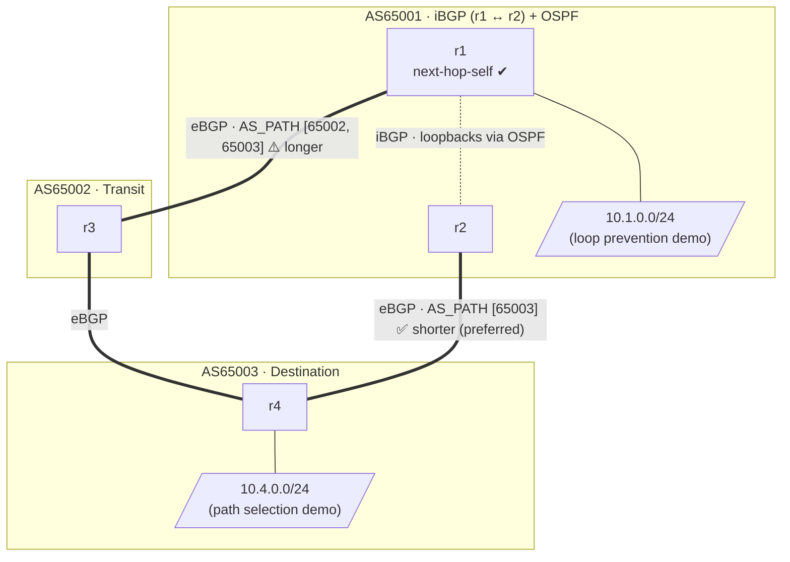

# netlab-bgp-basics-lab

[](https://codespaces.new/severindellsperger/netlab-bgp-basics-lab?machine=basicLinux32gb&devcontainer_path=.devcontainer/devcontainer.json)

A hands-on lab that uses [NetLab](https://netlab.tools) and [Containerlab](https://containerlab.dev) with [FRRouting (FRR)](https://frrouting.org) containers to demonstrate the fundamentals of BGP: eBGP and iBGP sessions, the next-hop-self requirement, AS_PATH-based path selection, Local Preference, and AS_PATH loop prevention — all in a single reproducible topology.

---

## Lab Topology



> ⚠️ **Default path selection:** `r1` and `r2` both have paths to `10.4.0.0/24` (AS65003).
> The direct path via `r2 → r4` has AS_PATH `[65003]` (length 1) and is preferred by default
> over `r1 → r3 → r4` which has AS_PATH `[65002, 65003]` (length 2).
> See the [Local Preference](#local-preference--overriding-as_path-selection) section to learn
> how to override this default with a higher `LOCAL_PREF`.

| Node | AS | Role | Stub network |
|------|----|------|--------------|
| `r1` | AS65001 | iBGP peer, eBGP to AS65002, **next-hop-self** | `10.1.0.0/24` |
| `r2` | AS65001 | iBGP peer, eBGP to AS65003 (direct) | — |
| `r3` | AS65002 | Transit router | — |
| `r4` | AS65003 | Destination router | `10.4.0.0/24` |

> **Note on IP addresses:** NetLab auto-assigns addresses from its default pools.
> Loopbacks use `10.0.0.x/32` and transit links use `172.16.x.x/30`. Run `netlab up`
> and inspect the generated `netlab.yml` for the exact assigned addresses.

---

## BGP Concepts Explained

### eBGP — External BGP

**eBGP** sessions are formed between routers in **different** autonomous systems.
Each AS is identified by a unique 2-byte ASN (AS65001, AS65002, AS65003 in this lab).

When a router forwards an eBGP update it **prepends its own ASN** to the `AS_PATH` attribute.
This creates a chain of ASes that every receiving router can inspect to:

1. **Select the best path** — shorter AS_PATH is preferred (all else being equal).
2. **Detect loops** — if a router's own ASN appears in the AS_PATH, the route is discarded.

In this lab there are three eBGP sessions:

| Session | Link | Purpose |
|---------|------|---------|
| `r1 ↔ r3` | AS65001 ↔ AS65002 | Indirect (transit) path to AS65003 |
| `r3 ↔ r4` | AS65002 ↔ AS65003 | Continuation of the transit path |
| `r2 ↔ r4` | AS65001 ↔ AS65003 | Direct path to AS65003 |

```bash
# Show all BGP neighbours on r1 (expect r2 via iBGP, r3 via eBGP)
netlab connect r1 -- vtysh -c "show bgp summary"

# Show the BGP table on r1 — look for 10.4.0.0/24 received via r3
netlab connect r1 -- vtysh -c "show bgp ipv4 unicast"
```

### iBGP — Internal BGP

**iBGP** sessions connect routers **within the same AS**.  Unlike eBGP, iBGP does **not**
prepend the local ASN to AS_PATH (the path attribute stays unchanged).  Two important
iBGP rules apply:

1. **Next-hop is not changed** — a route learned via eBGP and re-advertised over iBGP
   carries the original eBGP next-hop (the external peer's IP).
2. **iBGP split-horizon** — routes learned via iBGP are not re-advertised to other iBGP
   peers (to prevent loops inside the AS).

In this lab `r1` and `r2` form an iBGP session inside AS65001.  OSPF runs between them
so that their loopback addresses (used as BGP session endpoints) are mutually reachable.

```bash
# Show the iBGP session between r1 and r2
netlab connect r1 -- vtysh -c "show bgp neighbors"

# Show routes r1 received from r2 via iBGP
netlab connect r1 -- vtysh -c "show bgp ipv4 unicast neighbors <r2-loopback> received-routes"
```

### Next-Hop-Self — Why It Is Required

**The problem:**

1. `r1` (AS65001) establishes eBGP with `r3` (AS65002) over the `r1-r3` link.
2. `r4` (AS65003) originates `10.4.0.0/24` and advertises it to `r3`, which passes it to `r1`.
3. `r1` receives the route with **next-hop = r3's IP** on the `r1-r3` link (e.g., `172.16.1.1`).
4. `r1` re-advertises this route to `r2` via **iBGP**, preserving the original next-hop (`172.16.1.1`).
5. `r2` tries to install the route but **cannot resolve** `172.16.1.1`:
   - `r2` has no direct link to `r3`.
   - OSPF between `r1` and `r2` does not redistribute the inter-AS `r1-r3` subnet.
   - The route is marked invalid and **not installed** in r2's FIB.

**The solution — `next_hop_self: true` on r1:**

When `r1` sends an iBGP update to `r2`, it replaces the next-hop with **its own loopback IP**
(e.g., `10.0.0.1`).  `r2` can reach `r1`'s loopback via OSPF, so the route resolves
successfully and is installed.

```bash
# Show the BGP table on r2 — confirm next-hop resolves to r1's loopback
netlab connect r2 -- vtysh -c "show bgp ipv4 unicast 10.4.0.0/24"

# Expected: Next Hop = 10.0.0.1 (r1's loopback, reachable via OSPF)
# Without next_hop_self it would show r3's IP with status 'i' (inaccessible)

# Show that OSPF provides the next-hop resolution
netlab connect r2 -- vtysh -c "show ip route ospf"
```

**To observe the failure (temporarily disable next-hop-self):**

```bash
netlab connect r1 vtysh
```
```
configure terminal
router bgp 65001
 neighbor <r2-loopback> no next-hop-self
end
```
```bash
# r2 now shows the route as inaccessible (status bit 'i')
netlab connect r2 -- vtysh -c "show bgp ipv4 unicast 10.4.0.0/24"
```

Re-enable with `neighbor <r2-loopback> next-hop-self` when done.

---

### AS_PATH Length — Path Selection

BGP's default **path selection algorithm** evaluates multiple attributes in order.
When `LOCAL_PREF` is equal (default 100), **AS_PATH length** is the next tiebreaker —
shorter is preferred.

In this lab, AS65001 has **two paths** to `10.4.0.0/24` (AS65003):

| Path | Route | AS_PATH | Length | Preferred? |
|------|-------|---------|--------|------------|
| Direct | `r2 → r4` | `[65003]` | 1 | **Yes (default)** |
| Transit | `r1 → r3 → r4` | `[65002, 65003]` | 2 | No |

`r2` installs the direct eBGP route to `r4`.  Via iBGP, `r1` also learns `r2`'s shorter path
(`AS_PATH [65003]`) and prefers it over its own eBGP path to `r3` (`AS_PATH [65002, 65003]`).

```bash
# On r1: see both paths and observe which is best ('>')
netlab connect r1 -- vtysh -c "show bgp ipv4 unicast 10.4.0.0/24"
# '>' marks the best path; 'i' indicates an iBGP-learned path

# On r2: confirm the direct path is installed (AS_PATH [65003])
netlab connect r2 -- vtysh -c "show bgp ipv4 unicast 10.4.0.0/24"

# Show the installed route in the FIB
netlab connect r2 -- vtysh -c "show ip route 10.4.0.0/24"
```

---

### Local Preference — Overriding AS_PATH Selection

**`LOCAL_PREF`** is a well-known discretionary BGP attribute exchanged only over iBGP.
It represents the **local preference** for a route within an AS.
**Higher LOCAL_PREF wins** and is evaluated *before* AS_PATH length, allowing operators
to override the default shortest-path preference.

**Scenario:** Force AS65001 to prefer the transit path via r3 (AS65002) even though it has
a longer AS_PATH, by setting `LOCAL_PREF = 200` on routes received from r3.

#### Step 1 — Observe the default (AS_PATH wins)

```bash
netlab connect r1 -- vtysh -c "show bgp ipv4 unicast 10.4.0.0/24"
# Best path: learned via iBGP from r2 (AS_PATH [65003], LOCAL_PREF 100)
```

#### Step 2 — Set LOCAL_PREF on r1 for routes from r3

```bash
netlab connect r1 vtysh
```
```
configure terminal

ip prefix-list AS65003_ROUTES seq 5 permit 10.4.0.0/24

route-map SET_LOCAL_PREF permit 10
 match ip address prefix-list AS65003_ROUTES
 set local-preference 200
!

router bgp 65001
 neighbor <r3-ip> route-map SET_LOCAL_PREF in
!

end
clear bgp ipv4 unicast * soft in
```

#### Step 3 — Verify LOCAL_PREF overrides AS_PATH selection

```bash
# On r1: best path is now via r3 (LOCAL_PREF 200 > 100, despite longer AS_PATH)
netlab connect r1 -- vtysh -c "show bgp ipv4 unicast 10.4.0.0/24"

# r1 shares this path with r2 via iBGP, including LOCAL_PREF 200
# On r2: the iBGP path via r1 (LOCAL_PREF 200) now beats the direct eBGP path (LOCAL_PREF 100)
netlab connect r2 -- vtysh -c "show bgp ipv4 unicast 10.4.0.0/24"
# Best path changes from r4 (direct) to r1 (via iBGP carrying LOCAL_PREF 200)
```

---

### AS_PATH Loop Prevention

BGP uses the `AS_PATH` attribute to detect routing loops.  When a router receives an UPDATE
and finds its **own ASN already in the AS_PATH**, it **discards the route silently**.

**Scenario:** `10.1.0.0/24` is originated by `r1` in AS65001.

The path this prefix takes:
```
r1 (AS65001) → r3 (AS65002) → r4 (AS65003)
```

At each eBGP hop the sending router prepends its own ASN:

| Step | Router | AS_PATH after prepend |
|------|--------|-----------------------|
| Originate | r1 | `[ ]` (empty at origin) |
| r1 → r3 | r1 prepends 65001 | `[65001]` |
| r3 → r4 | r3 prepends 65002 | `[65002, 65001]` |

When `r4` now tries to advertise this prefix **back to r2** (AS65001):

- r4 would prepend 65003: `[65003, 65002, 65001]`
- `r2` (AS65001) receives the UPDATE and checks the AS_PATH
- **AS65001 is in the path** → the route is **rejected** → loop prevented ✓

```bash
# On r2: 10.1.0.0/24 appears as a local route (best) but NOT as received from r4
netlab connect r2 -- vtysh -c "show bgp ipv4 unicast 10.1.0.0/24"

# Verify r4 received the route but does NOT re-advertise it to r2
# On r4: show the route with AS_PATH
netlab connect r4 -- vtysh -c "show bgp ipv4 unicast 10.1.0.0/24"
# AS_PATH will contain 65001 — r4 will not forward this to any AS65001 peer

# Confirm on r2: no route received from r4 for 10.1.0.0/24
netlab connect r2 -- vtysh -c "show bgp ipv4 unicast neighbors <r4-ip> received-routes"
```

---

### BGP Messages — Open, Update, Keepalive

BGP uses four message types over a TCP connection (port 179):

| Message | Purpose |
|---------|---------|
| **OPEN** | Session establishment: exchange BGP version, ASN, Hold Time, BGP Identifier |
| **UPDATE** | Advertise new routes (NLRI + path attributes) or withdraw previously advertised routes |
| **KEEPALIVE** | Maintain the session when no UPDATE is pending (sent every ~60 s by default) |
| **NOTIFICATION** | Signal an error and close the session |

#### Observing BGP messages with FRR debug

> **Warning:** BGP debug output is verbose. Use it in a lab environment only and disable
> it promptly after capturing the desired messages.

```bash
# Open an interactive vtysh session on r1
netlab connect r1 vtysh
```

```
# Enable BGP debug for a specific neighbor (replace <r3-ip> with the actual IP)
debug bgp neighbor-events
debug bgp updates in
debug bgp updates out
debug bgp keepalives

# Reset the session to force a new OPEN exchange
clear bgp ipv4 unicast <r3-ip>
```

```bash
# Watch the real-time debug output in the FRR log
netlab connect r1 -- tail -f /var/log/frr/bgpd.log
```

**What to look for:**

- **OPEN message:** lines containing `BGP OPEN` with fields:
  - `Version: 4` — BGP-4
  - `My AS: 65001` — the sender's ASN
  - `Hold Time: 180` — negotiated hold time in seconds (default; Keepalive sent every 60 s)
  - `BGP Identifier` — the router ID (usually the highest loopback IP)

- **UPDATE message:** lines containing `BGP UPDATE` with:
  - `NLRI` — the prefix being advertised (e.g., `10.4.0.0/24`)
  - `AS_PATH` — the list of ASNs the route traversed
  - `NEXT_HOP` — the IP address to forward traffic toward

- **KEEPALIVE message:** periodic `BGP KEEPALIVE` lines confirming the session is alive.

```
# Disable debug when done
no debug bgp neighbor-events
no debug bgp updates in
no debug bgp updates out
no debug bgp keepalives
```

#### Inspecting attributes without debug

```bash
# Show detailed BGP path attributes for a specific prefix on r1
netlab connect r1 -- vtysh -c "show bgp ipv4 unicast 10.4.0.0/24"

# Show all routes received from r3 before policy (requires 'soft-reconfiguration inbound')
netlab connect r1 -- vtysh -c "show bgp ipv4 unicast neighbors <r3-ip> received-routes"

# Show all routes advertised by r1 to r3
netlab connect r1 -- vtysh -c "show bgp ipv4 unicast neighbors <r3-ip> advertised-routes"

# Show BGP community, local-pref, MED for a prefix
netlab connect r1 -- vtysh -c "show bgp ipv4 unicast 10.4.0.0/24 detail"
```

---

## Prerequisites

> **Tip:** You can skip local setup entirely by launching the lab in [GitHub Codespaces](#-launch-in-github-codespaces) — all dependencies are pre-installed in the dev container.

### 1. Install NetLab

Follow the official installation guide:
👉 **https://netlab.tools/install/**

```bash
python3 -m pip install networklab
netlab install --all
```

### 2. Clone this repository

```bash
git clone https://github.com/severindellsperger/netlab-bgp-basics-lab.git
cd netlab-bgp-basics-lab
```

---

## 🚀 Launch in GitHub Codespaces

Click the button below to open this lab in a pre-configured cloud environment — no local installation required:

[](https://codespaces.new/severindellsperger/netlab-bgp-basics-lab?machine=basicLinux32gb&devcontainer_path=.devcontainer/devcontainer.json)

Once the Codespace is ready, run `netlab up` in the terminal to start the lab.

---

## Starting the Lab

```bash
netlab up
```

`netlab up` will:
1. Parse `topology.yml` and auto-assign IP addresses and BGP parameters.
2. Generate Containerlab and FRR configuration files.
3. Start all containers via Containerlab.
4. Deploy the generated FRR configuration to every container.

After a few seconds BGP sessions should establish and routes should converge.

```bash
# Verify all BGP sessions are Established on r1
netlab connect r1 -- vtysh -c "show bgp summary"

# Show the full BGP table on r1
netlab connect r1 -- vtysh -c "show bgp ipv4 unicast"

# Confirm r2 can reach r4's stub network via the direct path
netlab connect r2 -- vtysh -c "show ip route 10.4.0.0/24"

# Confirm next-hop-self is working (next-hop should be r1's loopback, not r3's IP)
netlab connect r2 -- vtysh -c "show bgp ipv4 unicast 10.4.0.0/24"
```

You can also open an interactive vtysh shell on any device:

```bash
netlab connect r1 vtysh
```

Or connect directly via Docker (container names follow the pattern `clab-<lab-name>-<node>`):

```bash
docker exec -it clab-netlab-bgp-basics-lab-r1 vtysh
```

---

## Stopping the Lab

```bash
netlab down
```

`netlab down` destroys all containers and removes generated configuration files, leaving the repository in a clean state.

---

## License

This lab is provided as-is for educational purposes.
